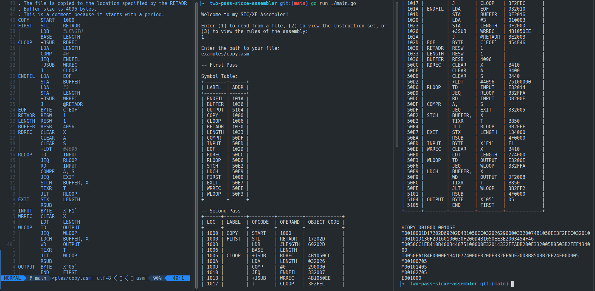

# SIC/XE Two-Pass Assembler
## Description
This is an open source SIC/XE two-pass assembler project written in Go that allows you to translate SIC/XE assembly language code into machine language.



## Getting Started
To get started with this assembler, you will need to download or clone the project to your local machine.

## Build
Prerequisites:
- Go 1.14 or higher

Clone the project form this GitHub repository:
```shell
https://github.com/Okira-E/two-pass-sicxe-assembler
```

To build a new binary, run:
```shell
go build -o build/assembler
```

## Usage
To use the assembler, simply run the following command:
```shell
./build/assembler
```

Chose the first prompt and give the relative location to your assembly file.

Assembly rules as well as features supported can be found by prompting the CLI with the 3rd option.

## How It Works
This assembler is a two-pass assembler, which means that it goes through the input file twice to generate the output file.

### First Pass
In the first pass, the assembler reads through the input file and generates a symbol table. The symbol table maps symbols (such as labels and variable names) to their corresponding memory addresses.

### Second Pass
In the second pass, the assembler reads through the input file again, this time generating the actual machine language code. As it reads each line of code, it replaces symbols with their corresponding memory addresses, using the symbol table generated in the first pass.

## Acknowledgments
- The SIC/XE architecture was designed by IBM in the 1960s.
- This project was inspired by the SIC/XE assembler project in "Systems Software: An Introduction to Systems Programming" by Leland L. Beck.

